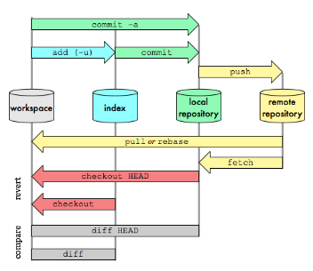

# ¿Que es GIT?

Es un software de control de versiones, su propósito es llevar registro de los cambios en archivos de computadora y coordinar el trabajo que varias personas realizan sobre archivos compartidos (También puedes trabajar solo no hay problema 😃). Existe la posibilidad de trabajar de forma remota como GitHub o GitLab, entre otros.

## ¿Para que usar GIT?

- Permite regresar a versiones anteriores de forma sencilla y muy rápida.
- Facilita el trabajo colaborativo.
- Permite respaldar tus proyectos en la nube (ej con github,GitLab).
- Reduce considerablemente los tiempos de deploy.
- Las "branches" o ramas, permiten trabajar con una base de código paralela al proyecto en sí.
- [Fuente](https://blog.coffeedevs.com/8-razones-para-usar-git/)

## Flujo de Trabajo de GIT.

