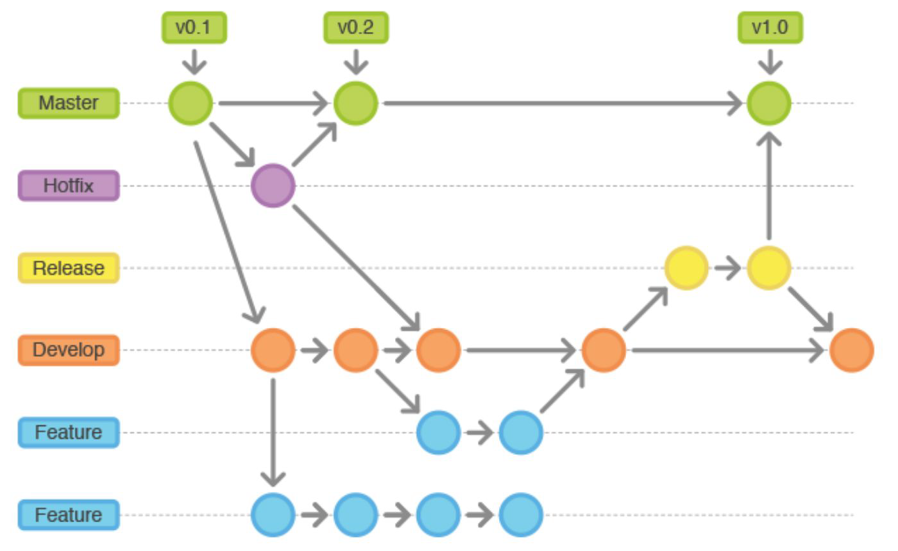

## Creando un Proyecto en Gitlab

### Actividad:

- Ingresa en tu cuenta de Gitlab en https://git.intelix.biz 
- Crea un nuevo proyecto con el nombre training-examples.
- Elige la pestaña de importar proyecto, y busca la opción de importar mediante una URL, utilizando: https://gitlab.com/gitlab-org/training-examples.git
- Ve a tu espacio de trabajo local y clona el proyecto.

## Commit

### Actividad:

- Edita el archivo **"edit_this_file.rb"** en **"training-examples.**
- Vea el archivo listado como modificado.
- Vea las diferencias del archivo.
- Almacene el archivo.
- Confirme el archivo.
- Empuje el cambio al repositorio remoto.
- Vealo el registro de cambios.

### Solución:

Modificación de **“edit_this_file.rb”**
```js
$ git status
```
```js
$ git diff
```
```js
$ git add edit_this_file.rb
```
```js
$ git commit -m "My Changes"
```
```js
$ git push origin master
```
```js
$ git log
```
## Branch por Funcionalidades.

- Flujo de trabajo más eficiente para equipos.
- Desarrollar cada funcionalidad / historia de usuario en una rama.
- Hace que sea fácil diseñar / desarrollar / probar / desplegar.
- Tratar de tener un enlace uno a uno a los problemas.
- Empuje la rama al repositorio remoto con frecuencia.

### Actividad:

- Crea una nueva rama llamada feature-squash-bugs.
- Edita el archivo **“bugs.rb”** y remueve todos los errores.
- Realiza un commit.
- Empuja los cambios al repositorio remoto.

### Solución:
```js
$ git checkout -b feature-squash-bugs
```
Modificación de **“bugs.rb”**
```js
$ git status
```
```js
$ git add bugs.rb
```
```js
$ git commit -m "Fix some bugs in code"
```
```js
$ git push origin feature-squash-bugs
```

## Solicitud de Unificación.

- Colaborar en ramas de funcionalidades.
- Cuando desee comentarios, cree una solicitud de unificación.
- Asignar a la persona que le gustaría revisar.
- Si no está listo para unirse y sólo desea comentarios, indíquelo en un comentario. Añade WIP en el título.
- Cuando se acepte siempre elimine la rama.
- Otras personas son libres de agregar comentarios.
- Empujar correcciones a la misma rama.

### Actividad:
- Crea una nueva solicitud de unificación.
- Utiliza el botón azul de la lista de actividades para crear una nueva solicitud a partir de la rama creada anteriormente.
- Verifica los cambios de la solicitud, adiciona una descripción y guarda la solicitud.
- Haz una nueva modificación y envía un nuevo commit a la misma rama de la solicitud.
- Ve los cambios en la solicitud y verifica que la misma está actualizada.


## Estartegias de Ramificación.

- Al manejar muchas ramas el mantenimiento de un proyecto se complica rápidamente.
- Todas las ramas de funcionalidades comienzan desde la rama de desarrollo y se van unificando hacia la rama principal.
- El modelo de ramificación Gitflow está muy bien documentado y presenta una solución adecuada para el despliegue de software.



## Etiquetas 
Las etiquetas son útiles para marcar despliegues y lanzamientos de nuevas versiones del producto.
- Las etiquetas anotadas son una parte inmutable de la historia como una confirmación.
- Las etiquetas blandas se pueden configurar y eliminar a voluntad.
- Muchos proyectos combinan una etiqueta de lanzamiento con una rama estable para esa versión menor.
- Considere configurar etiquetas de despliegue automáticamente.

### Actividad:
Establece una etiqueta suave y una etiqueta anotada en un repositorio dando un SHA1 de no más de 8 caracteres y empuja las etiquetas al repositorio remoto.

### Solución:
```js
$ git checkout master
```
Establece una etiqueta suave
```js
$ git tag ligth_tag
```
Establece una etiqueta anotada
```js
$ git tag -a v1.0.0 -m "Version 1.0.0"
```
```js
$ git push origin --tags
```
## Stash 

Usamos git stash para almacenar nuestros cambios cuando no están listos para confirmarse y necesitamos cambiar a una rama diferente.
```js
$ git stash save "this is a message to display on the list"
```
Aplicar para continuar haciendo cambios:
```js
$ git stash apply
```
Cada vez que guardamos un stash este se va apilando por lo que podemos usar el comando list para ver todos los elementos:
```js
$ git stash list
```
### Actividad:
- Modifica un archivo, prepáralo y esconde sus cambios.
- Ve la lista de elementos escondidos.
- Confirma que no existan cambios verificando el estado.
- Aplica los cambios escondidos mediante el comando apply.
- Ve nuevamente la lista de elementos escondidos y el estado.

### Solución:
Modifica el archivo edit_this_file.rb
```js
$ git add .
```
```js
$ git stash save "Saving changes"
```
```js
$ git stash list
```
```js
$ git status
```
```js
$ git stash apply
```
```js
$ git stash list
```
```js
$ git status
```

## Conflictos

- Son muy comunes en el mantenimiento de un proyecto.
- Se mitigan manteniendo una buena comunicación entre miembros del equipo.
- Se deben traer y sincronizar los cambios antes de enviar los locales.
- Estos conflictos deben resolverse uno por uno.
- Luego se confirman los cambios para la unificación del conflicto y se sincroniza con el repositorio remoto.

### Actividad:
- Crea una nueva rama y edita el archivo **“conflicts.rb”** añadiendo **"Line4"** y **"Line5"** debajo de **"Line3**"
- Haz commit y push en la rama.
- Cambia a la rama master y edita el archivo nuevamente añadiendo **"Line6"** y **"Line7"** debajo de **"Line3."**
- Haz commit y push a master.
- Crea una solicitud de unificación y observa como falla.

### Solución:
```js
$ git checkout -b conflicts_branch
```
Edita **“conflicts.rb”** añadiendo **"Line4"** y **"Line5"**
```js
$ git commit -am "add line4 and line5"
```
```js
$ git push origin conflicts_branch
```
```js
$ git checkout master
```
Edita “conflicts.rb” añadiendo **"Line6"** y **"Line7"**
```js
$ git commit -am "add line6 and line7"
```
```js
$ git push origin master
```
Crea una solicitud de mezcla.

### Deshacer

- Corrige el comentario del commit anterior
```js
$ git commit --amend -m "New Message"
```
- Deshace el último commit llevando todo al área de preparación
```js
$ git reset --soft HEAD^
```
- Deshace el último commit y descarta los cambios
```js
$ git reset --hard HEAD^
```
- Igual que el anterior pero deshace los dos últimos commits
```js
$ git reset --hard HEAD^^
```

### Actividad:
- Edita el archivo **"edit_this_file.rb"** y verifica el estado.
- Haz commit con un comentario erróneo y ve el mismo en el log.
- Corrige el comentario y ve el cambio en el log.
- Elimina el último commit llevando los cambios al area de preparacion y ve el cambio en el log.

### Solución:
Edita el archivo “edit_this_file.rb”
```js
$ git status
```
```js
$ git commit -am "qwerty"
```
```js
$ git log
```
```js
$ git commit --amend "New comment added"
```
```js
$ git log
```
```js
$ git reset --soft HEAD^
```
```js
$ git log
```

